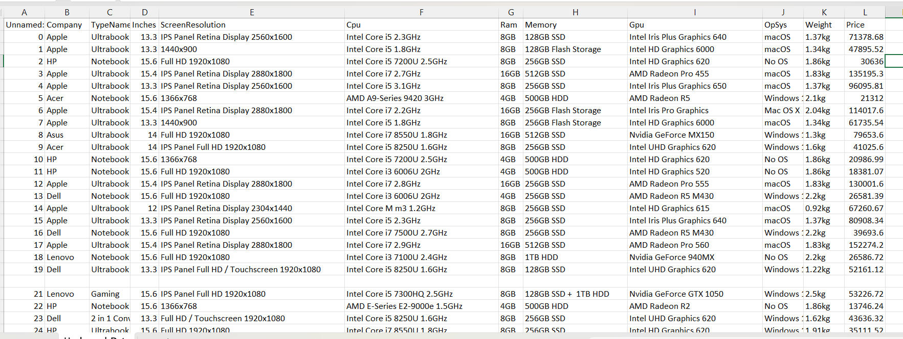

# Laptop Data Cleaning
## Project Overview
This project focuses on cleaning and transforming a raw laptop dataset using SQL to make it suitable for analysis and reporting. The raw data contained inconsistent formats, embedded attributes, and non-atomic values. Using SQL-based transformations, the dataset was normalized, enriched with derived features, and structured for analytical use cases.

The project demonstrates practical SQL data cleaning skills, commonly required in data analyst roles.
The Raw data looks like this 

