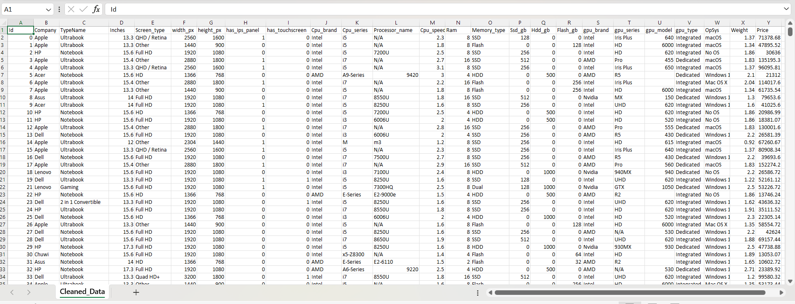

# Laptop Data Cleaning
## Project Overview
This project focuses on cleaning and transforming a raw laptop dataset using SQL to make it suitable for analysis and reporting. The raw data contained inconsistent formats, embedded attributes, and non-atomic values. Using SQL-based transformations, the dataset was normalized, enriched with derived features, and structured for analytical use cases.

The project demonstrates practical SQL data cleaning skills, commonly required in data analyst roles.

The Raw data looks like this 

##### As you can see there are lot of inconsistent formats :
1. ScreenResolution column has display type, height, width values.
2. Cpu column has Cpu brand, Cpu Series, Processor Speed values.
3. Memory Column has Memory type, SSD, HDD, Flash memory values.
4. Gpu Column has Gpu brand, Gpu Series, Gpu Type, Gpu Model number values.

After Cleaning this data look like this

The cleaned dataset is fully structured and analytics-ready, with:
1. Standardized numeric columns(Ram, Weight)
2. Extracted categorical features(Cpu brand, Cpu Series, Cpu speed, Memory Type, Gpu type, Gpu model)
3. Derived technical specifications(Width px, Height px,)
4. Clear separation of hardware components(Cpu series, Cpu speed)

Created New Feature like 
- has ips panel
- has touch screen

